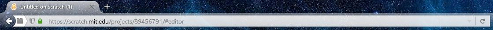

# ScratchMessageChecker
Checks your messages on any website.

Just change the 'user' variable to your scratch username, and every page you visit, the tab title will change depending on how many messages you have.
Example:

